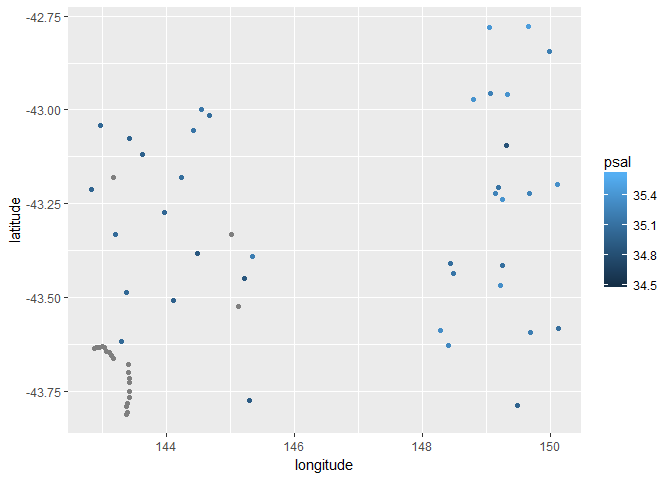
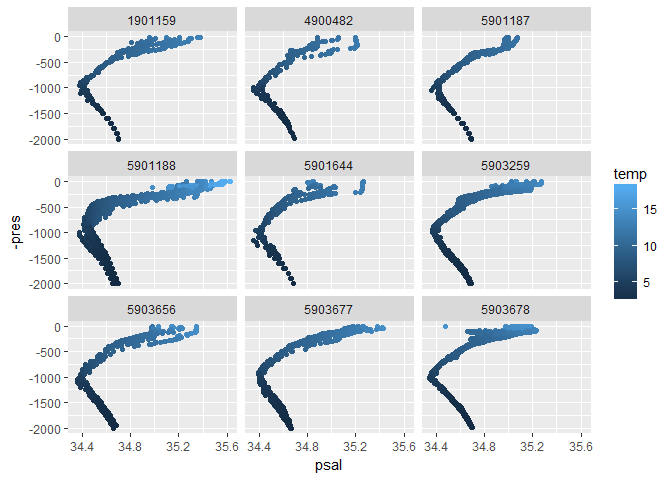

<!-- README.md is generated from README.Rmd. Please edit that file -->
[](https://travis-ci.org/mdsumner/raodn)

raodn
=====

The goal of raodn is to ...

Installation
------------

You can install raodn from github with:

``` r
# install.packages("devtools")
devtools::install_github("mdsumner/raodn")
```

Example
-------

This is a basic example that gets some Argo data.

``` r
library(raodn)
## read Argo data from AODN
example("read_aodn_csv")
#> 
#> rd_dn_> d <- read_aodn_csv(collection_url)
#> Parsed with column specification:
#> cols(
#>   .default = col_double(),
#>   FID = col_character(),
#>   url = col_character(),
#>   size = col_integer(),
#>   data_centre = col_character(),
#>   platform_number = col_integer(),
#>   cycle_number = col_integer(),
#>   direction = col_character(),
#>   data_state_indicator = col_character(),
#>   data_mode = col_character(),
#>   juld = col_datetime(format = ""),
#>   juld_qc = col_integer(),
#>   juld_location = col_datetime(format = ""),
#>   position_qc = col_integer(),
#>   position = col_character(),
#>   oxygen_sensor = col_character(),
#>   project_name = col_character(),
#>   level_no = col_integer(),
#>   pres_qc = col_integer(),
#>   pres_adjusted_qc = col_integer(),
#>   temp_qc = col_integer()
#>   # ... with 9 more columns
#> )
#> See spec(...) for full column specifications.
#> 
#> rd_dn_> #library(ggplot2)
#> rd_dn_> # ggplot(d[d$pres < 100, ]) + aes(longitude, latitude, col = psal) + geom_point()
#> rd_dn_> #ggplot(d) + aes(psal, -pres, col = temp) +
#> rd_dn_> # geom_point() +
#> rd_dn_> #  facet_wrap(~platform_number)
#> rd_dn_> 
#> rd_dn_> 
#> rd_dn_>
library(ggplot2)

ggplot(d[d$pres < 100, ]) + aes(longitude, latitude, col = psal) + geom_point()
#> Warning: Removed 38848 rows containing missing values (geom_point).
```



``` r
ggplot(d) + aes(psal, -pres, col = temp) + 
 geom_point() + 
  facet_wrap(~platform_number) 
#> Warning: Removed 51564 rows containing missing values (geom_point).
```


